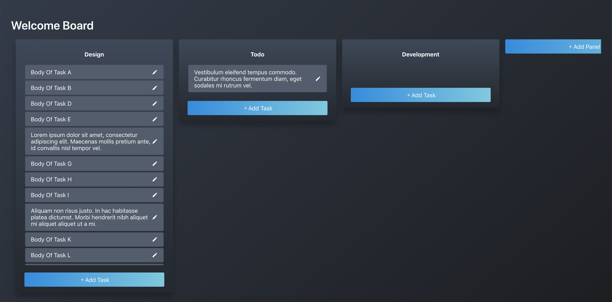

# Simple Drag and Drop Task



## Quick Overview

Install **```yarn```** to install dependencies.  
Then run  **```yarn run start```**.  
Runs the app in development mode.  
Open **```http://localhost:3000```** to view it in the browser.

The page will automatically reload if you make changes to the code.  
You will see the build errors and lint warnings in the console.

Note that the development build is not optimized.  
To create a production build, use **```yarn run build```**.

For testing, use **```yarn run test```**.  
Press **```a```** to run all tests,
